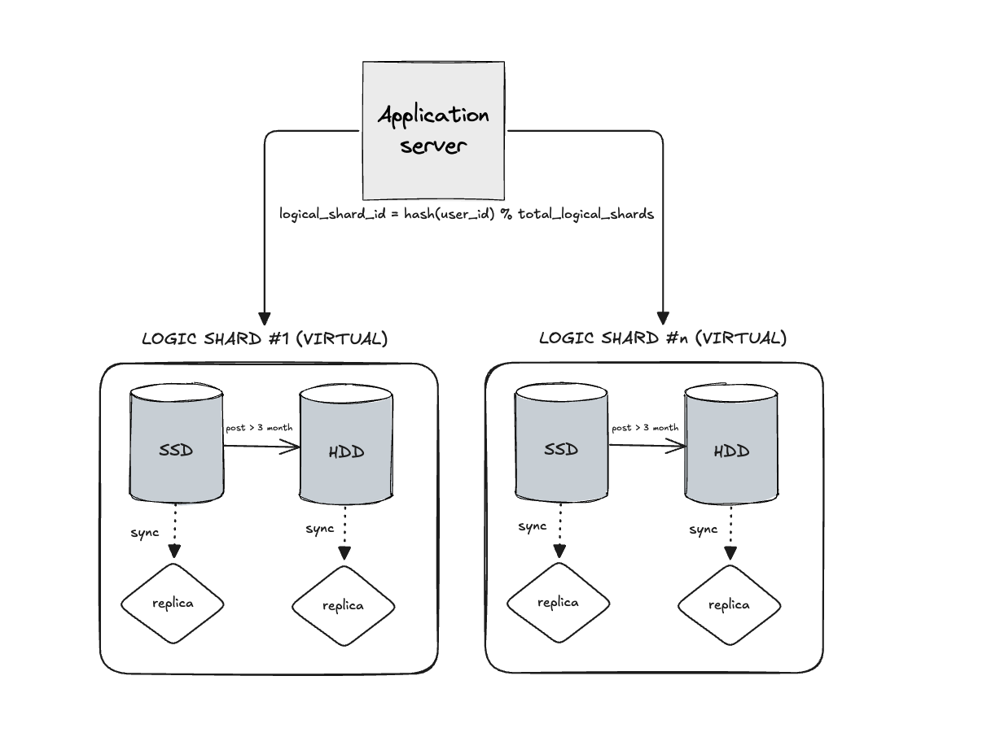

#### Шардирование

- Шардировать делаем по key-type с хэш-функцией по ключу от user_id. При этом будем охлаждать данные по дате создания поста. Все что старее 3 месяцев отправляется в холодное HDD хранилище
- Пользователь с конкретным ID всегда попадает на один и тот же логический шард (shard_id), и на уровне приложения мы его роутим на конкретную базу (визический шард) в котором лежат данные
- Храним данные к которым можем обратиться вместе - в одной базе лежат таблицы с постами, лайками, комментариями
- Таблички связанные с пользователями и подпиской на пользователей будут всегда в SSD хранилище, так как они не привязаны к посту и в целом являются частотными - подписаться, отписать, просмотреть список подписок.
- Миграция данных происходит **по единице поста** (пост + все его комментарии + лайки мигрируют вместе)
- Маршрутизация SSD/HDD происходит на уровне Application Server
- При чтении может потребоваться обращение к обеим базам (SSD + HDD)

#### Репликация
Выбор репликации Sync, Master-Slave репликация. Будем работать в сторону строгой согласованности, чтобы не разрешать проблемы с консистентностью. Большинство запросов (так как обычно просматриваются свежие данные) будут идти на SSD шарды, что позволит нам быстро отправлять и получать данные. 

